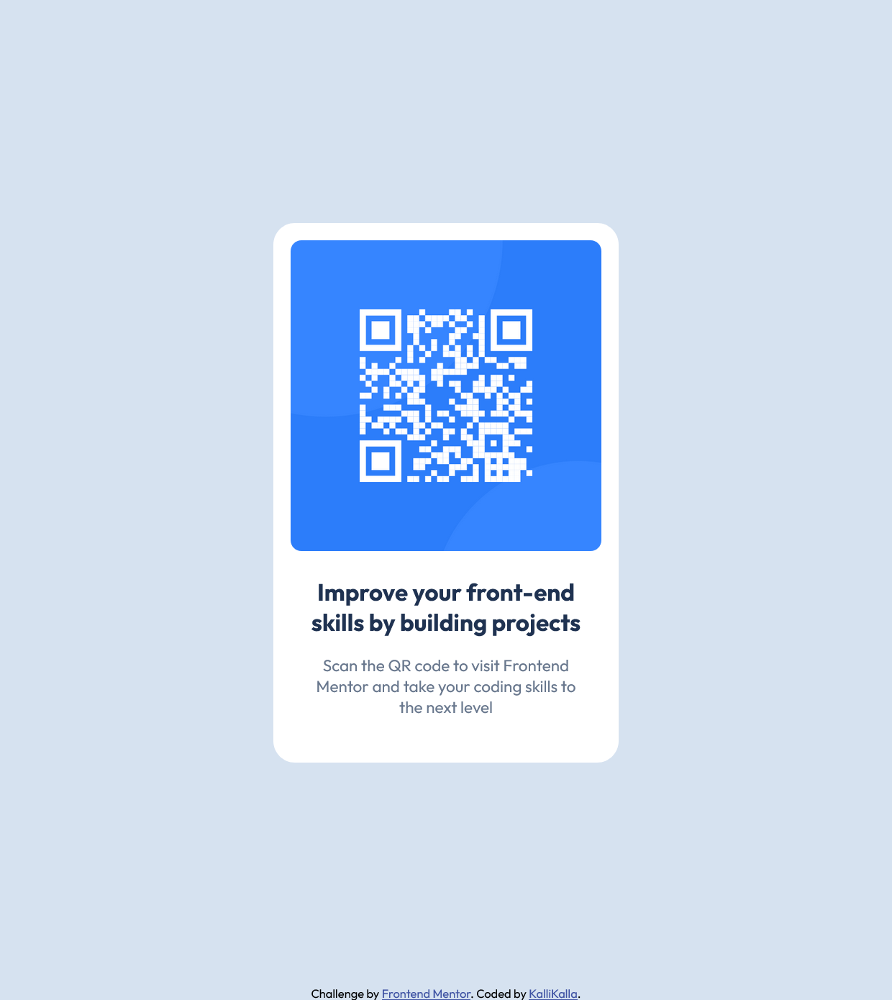

# Frontend Mentor - QR code component solution

This is a solution to the [QR code component challenge on Frontend Mentor](https://www.frontendmentor.io/challenges/qr-code-component-iux_sIO_H). Frontend Mentor challenges help you improve your coding skills by building realistic projects.

## Table of contents

- [Overview](#overview)
  - [Screenshot](#screenshot)
  - [Links](#links)
- [My process](#my-process)
  - [Built with](#built-with)
  - [What I learned](#what-i-learned)
  - [Continued development](#continued-development)
  - [Useful resources](#useful-resources)
- [Author](#author)
- [Acknowledgments](#acknowledgments)

## Overview

### Screenshot



### Links

- Solution URL: (https://github.com/KalliKalla/qr-code-component-main)
- Live Site URL: (https://kallikalla.github.io/FrontendMentor/qr-code-component-main/index.html)

## My process

### Built with

- Semantic HTML5 markup
- CSS custom properties (variables)
- Flexbox for centering
- Self-hosted fonts (Outfit)
- BEM naming methodology
- Responsive units (rem)
- Fixed-width card design

### What I learned

Through valuable feedback from the Frontend Mentor community, I learned several best practices:

1. **Self-hosting fonts for better performance** - Instead of loading all font weights from Google Fonts, I now self-host only the weights I need (400 and 700), improving load times.

2. **BEM naming methodology** - Adopted the Block Element Modifier naming convention for more maintainable CSS:

```css
.qr-card {
}
.qr-card__image {
}
.qr-card__title {
}
```

3. **CSS Custom Properties** - Implemented variables for colors, spacing, and typography for easier maintenance:

```css
:root {
  --color-bg: hsl(212, 45%, 89%);
  --spacing-sm: 1rem;
  --font-size-title: 1.47rem;
}
```

4. **Responsive units (rem over px)** - Switched from pixels to rem units for better accessibility and scaling.

5. **Preventing layout shifts** - Added width and height attributes to images to prevent Cumulative Layout Shift (CLS):

```html

```

### Continued development

In future projects, I want to focus on:

- Learning more about responsive design and when to use media queries
- Exploring CSS Grid for more complex layouts
- Improving my workflow with CSS preprocessors like Sass
- Better understanding of accessibility best practices

### Useful resources

- [Google Webfonts Helper](https://gwfh.mranftl.com/fonts) - Excellent tool for downloading and self-hosting Google Fonts
- [BEM Methodology](https://getbem.com/) - Official guide to BEM naming convention
- [Kevin Powell's Conquering Responsive Layouts](https://courses.kevinpowell.co/conquering-responsive-layouts) - Free 21-day course on responsive design and when to use rem vs px
- [CSS Tricks Flexbox Guide](https://css-tricks.com/snippets/css/a-guide-to-flexbox/) - Comprehensive flexbox reference
- [MDN Web Docs](https://developer.mozilla.org) - Essential reference for web standards

## Author

- Frontend Mentor: https://www.frontendmentor.io/profile/KalliKalla

## Acknowledgments

Special thanks to **Elmar Chavez ([@CodingWithJiro](https://www.frontendmentor.io/profile/CodingwithJiro))** for his incredibly detailed and constructive feedback on my solution. His suggestions helped me improve the code significantly by:

- Implementing self-hosted fonts for better performance
- Adopting BEM naming methodology
- Using CSS custom properties for maintainability
- Switching to rem units for better accessibility
- Adding proper image attributes to prevent layout shifts
- Implementing a comprehensive CSS reset

His mentorship exemplifies the supportive nature of the Frontend Mentor community!
