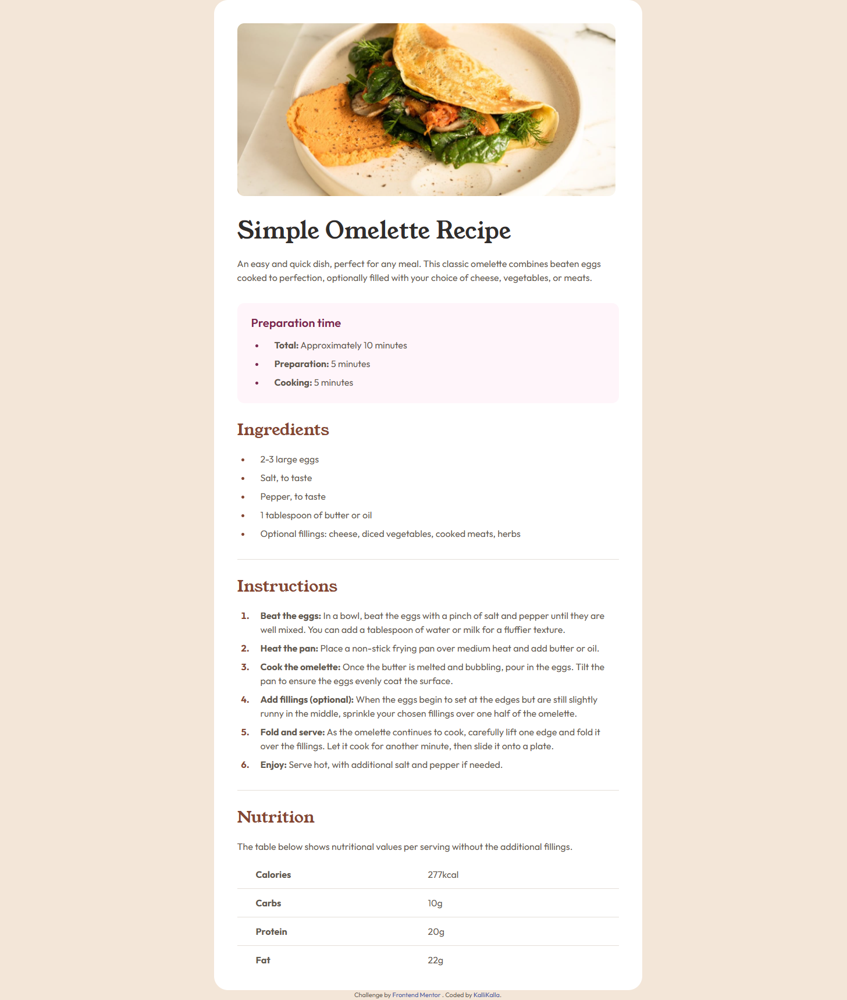

# Frontend Mentor - Recipe page solution

This is a solution to the [Recipe page challenge on Frontend Mentor](https://www.frontendmentor.io/challenges/recipe-page-KiTsR8QQKm). Frontend Mentor challenges help you improve your coding skills by building realistic projects.

## Table of contents

- [Overview](#overview)
  - [The challenge](#the-challenge)
  - [Screenshot](#screenshot)
  - [Links](#links)
- [My process](#my-process)
  - [Built with](#built-with)
  - [What I learned](#what-i-learned)
  - [Continued development](#continued-development)
- [Author](#author)
- [Acknowledgments](#acknowledgments)

## Overview

### The challenge

Your challenge is to build out this recipe page and get it looking as close to the design as possible.

### Screenshot

### Links

- Solution URL: https://github.com/KalliKalla/FrontendMentor/tree/master/recipe-page-main
- Live Site URL: [Add live site URL here](https://your-live-site-url.com)

## My process

### Built with

- Semantic HTML5 markup
- CSS custom properties
- Flexbox
- BEM naming methodology
- Self hosted font
- Media query to address both mobile and desktop layouts

### What I learned

Got more comfortable with using the BEM naming methodology. I made an attempt at making my CSS more organised by breaking up the code into sections.

### Continued development

I want to learn to use utility classes to make my code more organised.

## Author

- Frontend Mentor: (https://www.frontendmentor.io/profile/KalliKalla)

## Acknowledgments
