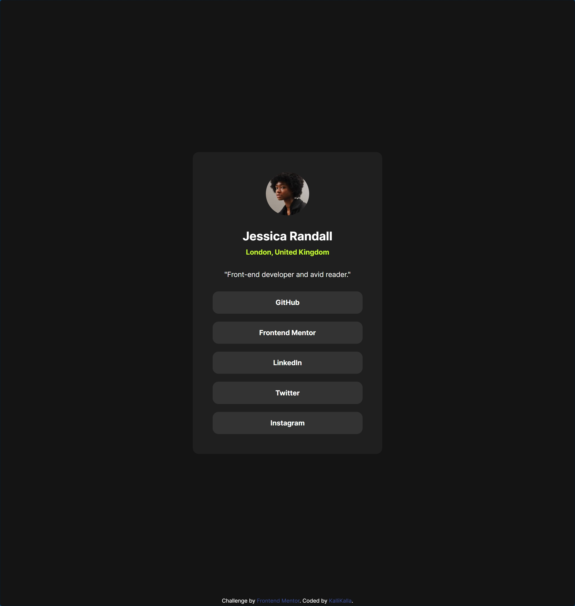

# Frontend Mentor - Social links profile solution

This is a solution to the [Social links profile challenge on Frontend Mentor](https://www.frontendmentor.io/challenges/social-links-profile-UG32l9m6dQ). Frontend Mentor challenges help you improve your coding skills by building realistic projects.

## Table of contents

- [Overview](#overview)
  - [The challenge](#the-challenge)
  - [Screenshot](#screenshot)
  - [Links](#links)
- [My process](#my-process)
  - [Built with](#built-with)
  - [What I learned](#what-i-learned)
  - [Continued development](#continued-development)
  - [Useful resources](#useful-resources)
- [Author](#author)
- [Acknowledgments](#acknowledgments)

## Overview

### The challenge

Users should be able to:

- See hover and focus states for all interactive elements on the page

### Screenshot

### Links

- Solution URL: https://github.com/KalliKalla/FrontendMentor/tree/master/social-links-profile-main
- Live Site URL: https://kallikalla.github.io/FrontendMentor/social-links-profile-main/index.html

## My process

### Built with

- Semantic HTML5 markup
- CSS custom properties
- Flexbox
- CSS Grid
- Mobile-first workflow
- BEM naming methodology
- Self hosted font
- Media query to address both mobile and desktop without media queries

### What I learned

Getting more comfortable with analysing Figma designs. I switched to using Chrome dev tools from Firefox. I find them better for viewing margins and padding.

### Continued development

In future projects, I want to focus on:

- Learning more about responsive design
- Better understanding of accessibility best practices

### Useful resources

## Author

- Frontend Mentor: https://www.frontendmentor.io/profile/KalliKalla

## Acknowledgments
